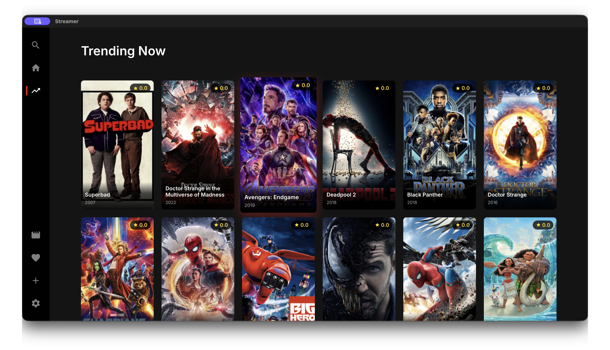
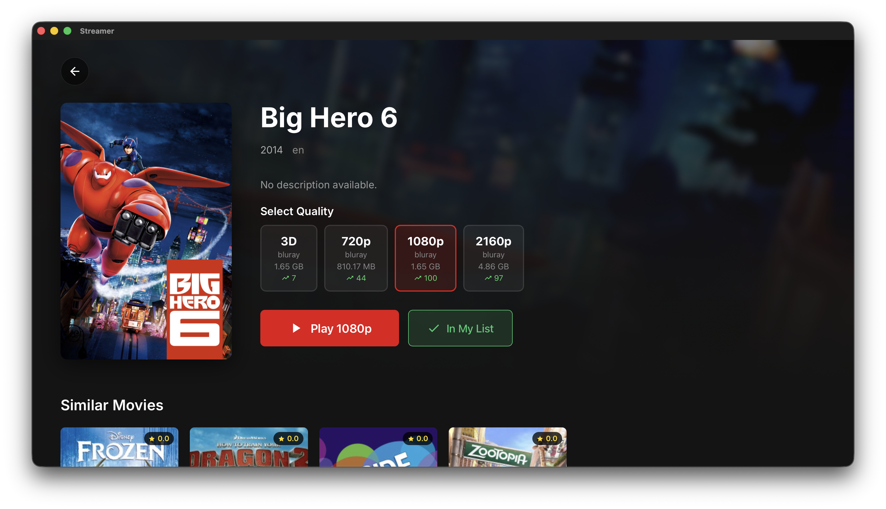
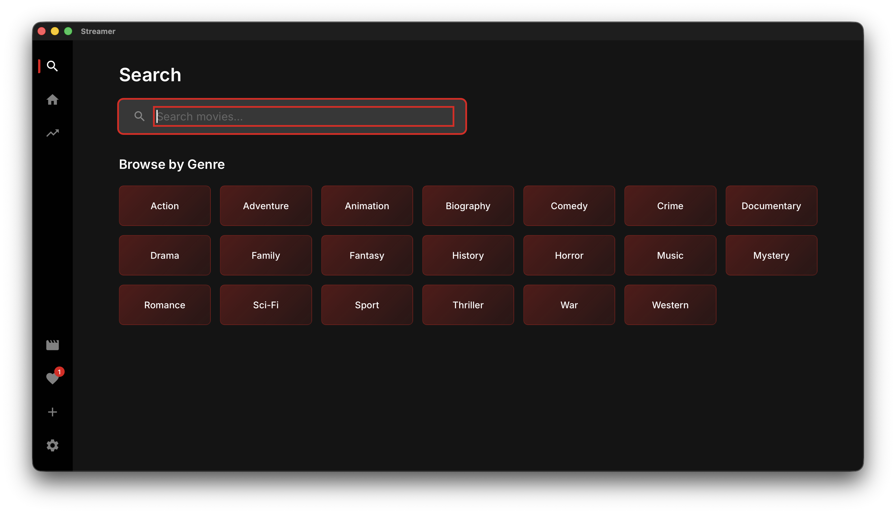
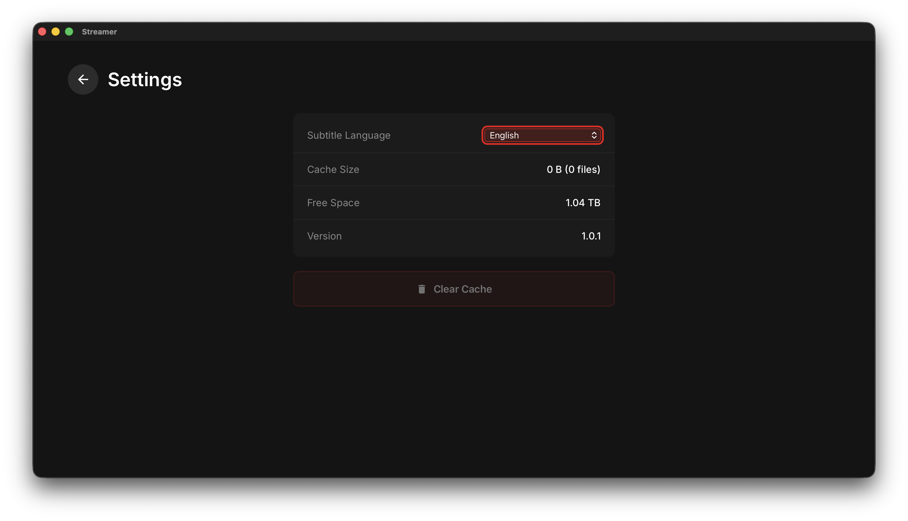

<div align="center">

# Omnius

**Stream movies on your Android TV with a Netflix-style experience**

[](https://github.com/CoolEntertainmentRepos/omnius/releases)
[](LICENSE)
[](#downloads)



</div>

---

## Features

- **Netflix-style UI** - Beautiful, familiar interface optimized for TV screens
- **D-pad Navigation** - Full remote control support for Android TV
- **In-app Streaming** - Watch movies directly without leaving the app
- **Subtitles** - Auto-load subtitles in 60+ languages via SubDL
- **Live TV** - Watch live channels from around the world
- **Search & Browse** - Find movies by title, genre, or rating
- **Auto Updates** - Get notified when new versions are available

## Screenshots

<table>
  <tr>
    <td></td>
    <td></td>
  </tr>
  <tr>
    <td align="center"><b>Browse Movies</b></td>
    <td align="center"><b>Movie Details</b></td>
  </tr>
  <tr>
    <td></td>
    <td></td>
  </tr>
  <tr>
    <td align="center"><b>Video Player</b></td>
    <td align="center"><b>Settings</b></td>
  </tr>
</table>

## Downloads

| Platform | Architecture | Download |
|----------|--------------|----------|
| Android TV | ARM (Mi Box, older devices) | [Download APK](https://github.com/CoolEntertainmentRepos/omnius/releases/latest/download/Omnius-android-tv-arm.apk) |
| Android TV | ARM64 (Shield, newer devices) | [Download APK](https://github.com/CoolEntertainmentRepos/omnius/releases/latest/download/Omnius-android-tv-arm64.apk) |
| macOS | Apple Silicon | [Download DMG](https://github.com/CoolEntertainmentRepos/omnius/releases/latest/download/Omnius-macos-arm64.dmg) |
| macOS | Intel | [Download DMG](https://github.com/CoolEntertainmentRepos/omnius/releases/latest/download/Omnius-macos-x64.dmg) |

## Installation

### Android TV

1. Download the APK for your device architecture
2. Enable **"Install from unknown sources"** in Settings > Security
3. Install using a file manager or via ADB:
   ```bash
   adb install Omnius-android-tv-arm64.apk
   ```

### macOS

1. Download the DMG for your Mac
2. Open the DMG and drag **Omnius** to Applications
3. First launch: Right-click > Open (to bypass Gatekeeper)

## Tech Stack

| Layer | Technology |
|-------|------------|
| Framework | [Tauri 2.0](https://tauri.app) |
| Frontend | [SvelteKit](https://kit.svelte.dev) + TypeScript |
| Backend | Rust |
| Torrent Engine | [librqbit](https://github.com/ikatson/rqbit) |
| Subtitles | [SubDL API](https://subdl.com) |
| TV Navigation | Spatial Navigation |

## Development

### Prerequisites

- Node.js 18+
- Rust 1.70+
- Android SDK & NDK (for Android builds)

### Setup

```bash
# Install dependencies
pnpm install

# Run development server
pnpm tauri dev

# Build for production
pnpm tauri build
```

### Android TV Build

```bash
# Build and install on connected device
./build-tv.sh
```

### Release

```bash
# Auto-increment patch version and release
./scripts/release.sh

# Specify version bump type
./scripts/release.sh minor  # 1.0.0 -> 1.1.0
./scripts/release.sh major  # 1.0.0 -> 2.0.0
```

## Requirements

- **Android TV**: Android 7.0+ (API 24)
- **macOS**: macOS 10.15+
- Internet connection for streaming

## License

MIT License - see [LICENSE](LICENSE) for details.

---

<div align="center">

**[Website](https://omnius.lol) · [Report Bug](https://github.com/CoolEntertainmentRepos/omnius/issues) · [Request Feature](https://github.com/CoolEntertainmentRepos/omnius/issues)**

</div>
